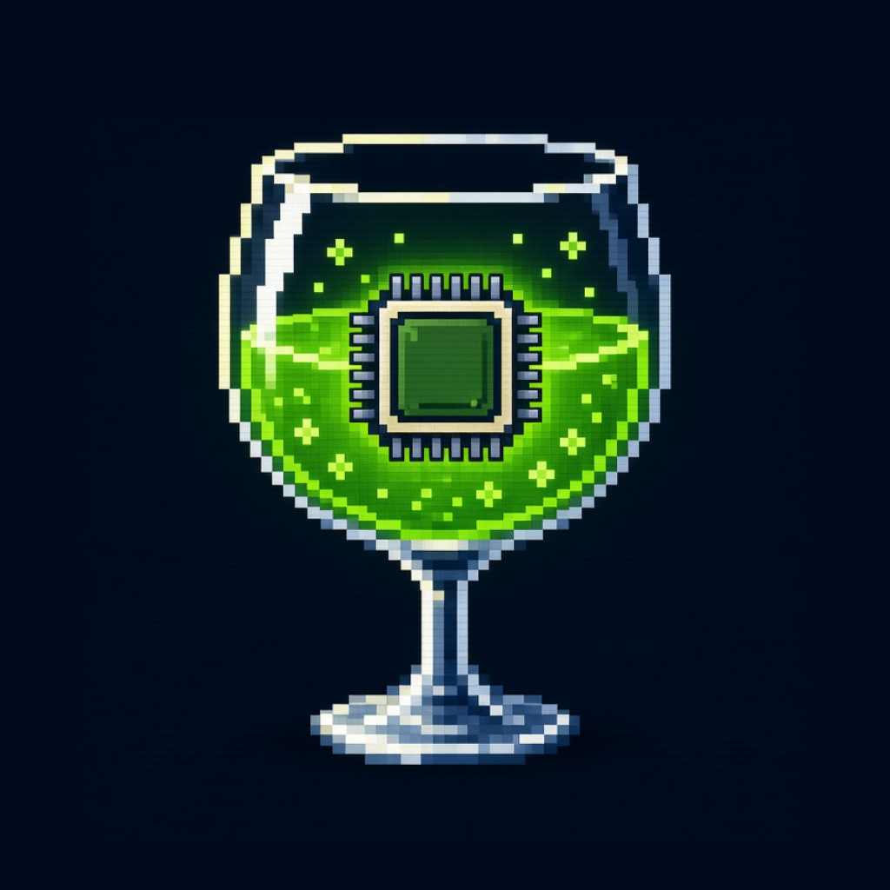
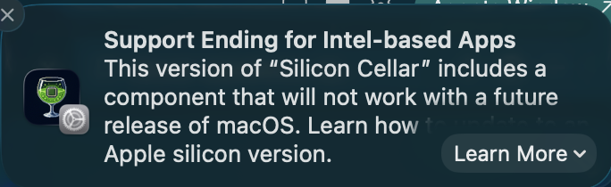

<p align="center">
  
</p>

# Silicon Cellar

[](https://github.com/NorseGaud/SiliconCellar/actions/workflows/ci.yml)
[](https://github.com/NorseGaud/SiliconCellar/actions/workflows/codeql.yml)
[](https://github.com/NorseGaud/SiliconCellar/actions/workflows/zizmor.yml)
[](https://scorecard.dev/viewer/?uri=github.com/NorseGaud/SiliconCellar)
[](LICENSE)
[](https://github.com/NorseGaud/SiliconCellar/releases/latest)
[](https://github.com/NorseGaud/SiliconCellar/releases)


[](https://github.com/NorseGaud/wine/releases)
[](https://github.com/sponsors/NorseGaud)
[](https://buymeacoffee.com/t2ihlmy2bu)

Run Windows games that you own on Apple Silicon. The games come from Steam, Battle.net, or the RSI Launcher. The app bundles Wine. It does not include game files or a game license.

> **Limited time.** macOS warns that support for Intel-based apps is ending. Silicon Cellar bundles Wine, which still runs as Intel code under Rosetta. Enjoy it while you can.
>
> <p align="center">
>   
> </p>

## What you need

- An Apple Silicon Mac
- Rosetta
- The Wine Engine bundled in the app (`Contents/Resources/Engine`). It is Wine 11.0 from the CodeWeavers CrossOver 26.3 source with Silicon Cellar fixes, built in [NorseGaud/wine](https://github.com/NorseGaud/wine). Packaging downloads the pinned [release](https://github.com/NorseGaud/wine/releases).
- An account for the store that sells the game (Steam, Battle.net, or the RSI Launcher)

## Install

```sh
brew install --cask norsegaud/siliconcellar/siliconcellar
```

The cask is in [NorseGaud/homebrew-siliconcellar](https://github.com/NorseGaud/homebrew-siliconcellar). Or download the DMG from [Releases](https://github.com/NorseGaud/SiliconCellar/releases). `brew uninstall --zap --cask siliconcellar` also removes the Wine prefix, Steam, and games under `~/Library/Application Support/SiliconCellar`.

## Supported games

Each game below has a recipe in `Recipes/`. When you add a recipe, add the game to this list (`make test` checks this). A checkmark means the game was installed and played with the current recipe. After that test, change `[ ]` to `[x]`.

[`Recipes/QUEUE.md`](Recipes/QUEUE.md) is the list of owned games that do not have a recipe yet. `Recipes/spacewar.json` is the example recipe. It is not a supported game.

- [x] [Age of Empires II (2013)](Recipes/aoe2-hd.json)
- [ ] [Age of Empires II: Definitive Edition](Recipes/aoe2.json)
- [x] [Age of Empires III (2007)](Recipes/aoe3-2007.json)
- [ ] [Age of Empires III: Definitive Edition](Recipes/aoe3.json)
- [ ] [Age of Empires IV](Recipes/aoe4.json)
- [ ] [Age of Mythology: Retold](Recipes/aom-retold.json)
- [x] [Assassin's Creed](Recipes/assassins-creed.json)
- [ ] [BRINK](Recipes/brink.json)
- [ ] [Command & Conquer: Generals Zero Hour](Recipes/zero-hour.json)
- [ ] [Command & Conquer: Red Alert 2](Recipes/red-alert2.json)
- [ ] [Company of Heroes 3](Recipes/coh3.json)
- [ ] [Counter-Strike 2](Recipes/cs2.json)
- [ ] [Diablo II: Resurrected](Recipes/d2r.json)
- [ ] [Diablo IV](Recipes/diablo4.json)
- [ ] [Elden Ring](Recipes/elden-ring.json)
- [ ] [Grand Theft Auto: San Andreas – The Definitive Edition](Recipes/san-andreas-de.json)
- [ ] [Heroes of Might and Magic III](Recipes/heroes3.json)
- [ ] [Hogwarts Legacy](Recipes/hogwarts-legacy.json)
- [x] [MDK](Recipes/mdk.json)
- [x] [MDK 2](Recipes/mdk2.json)
- [ ] [Overwatch](Recipes/overwatch.json)
- [ ] [Path of Exile 2](Recipes/poe2.json)
- [ ] [Red Dead Redemption 2](Recipes/rdr2.json)
- [ ] [The Elder Scrolls V: Skyrim Special Edition](Recipes/skyrim-se.json)
- [ ] [Star Citizen](Recipes/star-citizen.json)
- [ ] [The Witcher 3: Wild Hunt — Remastered](Recipes/witcher3.json)

## Build

For day-to-day development (lint, test, `make dev`, Engine build), see [CONTRIBUTING.md](CONTRIBUTING.md).

```sh
cd ~/DEV/siliconcellar
make
```

Bare `make` runs lint, tests, a debug build, a fresh Engine fetch from the pinned NorseGaud/wine release, then the signed and notarized release DMG. See [RELEASING.md](RELEASING.md) for credentials.

CLI binary: `.build/debug/siliconcellar-cli`  
App bundle: `dist/SiliconCellar.app`  
Engine: `dist/SiliconCellar.app/Contents/Resources/Engine/`  
DMG: `SiliconCellar-<version>-<build>.dmg`

For daily UI work, run `make dev`. That builds SiliconCellar, wraps it in `.build/dev/SiliconCellar.app` (with the app icon), opens the window, and relaunches after you save a Swift or recipe file. This is a rebuild, not an in-place hot reload. Stop with Ctrl+C. `make app` builds only the packaged `dist/SiliconCellar.app`. `make ci` is the unsigned CI path (no Engine download).

## Add a game

1. Get the Steam data for the game: `scripts/steam-app-info.py <Steam app ID>`. It reads the local Steam caches and prints `installFolder`, the Windows launch executables, and their arguments. `scripts/steam-app-info.py --owned` lists all owned games and shows which ones have a recipe.
2. Copy the recipe of a similar game (same launcher, same era of DirectX), or `Recipes/spacewar.json`. Change the fields.
3. Put the file in `Recipes/`. The `id` must match the file name. For a personal recipe that stays out of git, use `~/Library/Application Support/SiliconCellar/Recipes/`.
4. Add the game to [Supported games](#supported-games) with `[ ]`. `make test` fails if a recipe in `Recipes/` is not in that list.
5. Install and play the game. When it plays, change `[ ]` to `[x]` in Supported games, and mark its line in [`Recipes/QUEUE.md`](Recipes/QUEUE.md) with `[x]`. If the recipe needs more than the Steam default launch, write the fix on that queue line.

```json
{
  "id": "my-game",
  "title": "My Game",
  "steamID": "123456",
  "installFolder": "My Game Folder",
  "executable": "MyGame.exe",
  "executableRelativePath": "Binaries/Win64/MyGame.exe",
  "wineWindowsVersion": "win10",
  "steamArguments": [],
  "environment": {},
  "dllOverrides": "dxgi,d3d11,d3d12=n,b"
}
```

`steamID` is the Steam app number. `installFolder` is the Steam `installdir` name. `executable` is the file that Silicon Cellar waits for. `executableRelativePath` is its path under `installFolder` when it is not at the top. `environment` adds Wine environment values for the launcher and the game.

These optional fields change how the game starts. `Sources/SiliconCellarCore/Recipe.swift` is the full list.

| Field | Use |
| --- | --- |
| `directLaunch` | `true` starts Steam, then runs `executable` through Wine, not `-applaunch`. Use it when Steam starts a launcher that fails. |
| `executableArguments` | Arguments after the executable for a direct launch (for example `["SKIPINTRO"]`). |
| `quarantineFiles` | Files in the install folder to move aside before play (for example a DDrawCompat `ddraw.dll`). |
| `seedFiles` | Files to write under the install folder before play (for example `steam_appid.txt`). |
| `wineD3DRenderer` | Wine `Direct3D` renderer for this executable: `gl`, `vulkan`, `gdi`, or `no3d`. |
| `wineVirtualDesktop` | Wine virtual desktop for a direct launch: `WIDTHxHEIGHT`, or `display` for the Mac screen size. |
| `macDriverOptions` | Wine Mac driver values for this executable (for example `{"FullscreenBelowNotch": "y"}`). |

[`Recipes/QUEUE.md`](Recipes/QUEUE.md) lists the Windows-only Steam games that do not have a recipe yet. Each line gives the Steam ID, the install folder, and the executable. The app loads only `.json` files from `Recipes/`, so it ignores this file.

### Launcher

A recipe with `steamID` can use Steam. A recipe with `battleNetProductCode` can use Battle.net. That code is the one that Battle.net uses in `--exec="launch <code>"` (for example `OSI` for Diablo II: Resurrected). For Battle.net, `installFolder` is the folder that Battle.net makes in `C:\Program Files (x86)`.

A recipe with `rsiChannel` can use the RSI Launcher. That value is the Star Citizen channel folder (for example `LIVE`). `installFolder` is the folder under `C:\Program Files\Roberts Space Industries`. Install the game in that folder. Play opens the RSI Launcher. Click **Launch** there. See `Recipes/star-citizen.json`.

A recipe with more than one launcher can use any of them. Steam is the default. In the app, choose the launcher at the top of the game page. With the CLI, use `launcher --game ID --use steam|battlenet|rsi`. Silicon Cellar saves the choice in `launcher-choices.json` in the data folder. Each launcher has its own prefix, so each launcher installs its own copy of the game. Use the launcher of the store where you bought the game. The optional `launcher` field sets a fixed launcher for a recipe. See `Recipes/d2r.json` and `Recipes/star-citizen.json`.

The optional `profileFolders` field lists folders under the Windows user profile (`C:\users\crossover`) that Silicon Cellar creates before play. D2R from Steam needs `AppData/Local/Blizzard Entertainment/ClientSdk`. Without it, the game says that you were not online in the last 30 days.

### Renderer

The optional `renderer` field selects the Direct3D layer for the game's executable. Steam and other games keep Wine's own layers.

| `renderer` | Layer | Licence |
| --- | --- | --- |
| `wine` (default) | Wine wined3d (Direct3D 9 to 11) and vkd3d (Direct3D 12) | LGPL 2.1 |
| `dxvk` | DXVK-Sikarugir-async v1.10.3 (Direct3D 9 to 11 on Vulkan) | zlib |
| `dxmt` | DXMT v0.80-213-g4ddb20e (Direct3D 10 and 11 on Metal) | LGPL 2.1 |
| `dxmt-v0.72` | DXMT v0.72 | MIT |
| `d3dmetal` | Apple D3DMetal 4.0 beta 2 (Direct3D 11 and 12 on Metal) | Apple EA18380 |
| `d3dmetal-3.0` | Apple D3DMetal 3.0 | Apple EA18380 |

At the first **Play**, Silicon Cellar downloads the pinned package from [NorseGaud/siliconcellar-renderers](https://github.com/NorseGaud/siliconcellar-renderers/releases/tag/r1) into `~/Library/Application Support/SiliconCellar/renderers/<renderer>`, and checks its SHA-256. Each package contains the unchanged upstream files and their licences. Then Silicon Cellar writes `HKCU\Software\Wine\AppDefaults\<executable>\SiliconCellar\DllPath` (and `D3DSharedPath` for D3DMetal). The Engine loads the package DLLs for that executable only. Keep `dllOverrides` at `dxgi,d3d11,d3d12=n,b` (or include the DLLs of the layer).

Before a game uses D3DMetal, you must accept Apple's licence. The app shows it at the first **Play**. In the CLI, read `renderers/d3dmetal/License.rtf`, then run `siliconcellar accept-apple-license`. The licence permits use only to develop, test, or evaluate games, and only for non-commercial purposes.

## CLI

```sh
siliconcellar list
siliconcellar setup --game spacewar
siliconcellar steam --game spacewar
siliconcellar logout --game spacewar
siliconcellar install --game spacewar
siliconcellar uninstall --game spacewar
siliconcellar play --game spacewar
siliconcellar stop --game spacewar
siliconcellar accept-apple-license
```

Optional: `--data-root PATH`, `--recipes PATH`, `SILICONCELLAR_WINE`, `SILICONCELLAR_RECIPES`.

Each launcher has its own Wine prefix: `prefix` for Steam, `prefix-battlenet` for Battle.net, and `prefix-rsi` for the RSI Launcher. All games of a launcher share its prefix, so a problem in one launcher cannot break the other. The launchers can run at the same time. **Stop** and `stop` close only the launcher of the selected game. Each launcher runs one install or launch at a time. Setup deletes leftover `Games/` and `SteamCMD/` folders from older Silicon Cellar builds. Recipes stay.

The default location is `~/Library/Application Support/SiliconCellar`. **Storage** in the app can put the prefixes on another APFS or ExFAT drive. The app keeps a record of that drive on this Mac. Wine and recipes stay on this Mac. On ExFAT, the games live in a disk image so Wine links keep working. Connect the same drive before you play. `--data-root` still uses the path you pass.

## Flow

**App:** Install Rosetta if it is missing. Launch `SiliconCellar.app` with a bundled Engine. The detail pane shows one action per row, in order: **Install Steam** / **Stop Steam**, **Sign in** / **Sign out of Steam**, **Install game** / **Uninstall**, **Play** / **Stop**. Each button swaps when the status changes. **Sign in** opens the Steam window. Sign in there. Silicon Cellar does not take an account name or password.

**CLI:** Install Rosetta. Use a packaged app Engine, or set `SILICONCELLAR_WINE` to a `wine` binary. Then:

1. Run `setup`. The tool creates a Wine prefix and installs the official Steam client.
2. Run `steam` and sign in in the Steam window.
3. Run `install`, then `play`. Play starts Steam with `-applaunch`.

The Steam client owns sign-in, ownership, and updates. **Sign out** / `logout` clears local `loginusers.vdf` when Steam is not running. If Steam is open, sign out in the Steam window.

For a Battle.net game, the same steps use Battle.net. `setup` installs the official Battle.net client and opens it. Sign in in the Battle.net window. `install` opens the game page. Click **Install** there, and Silicon Cellar waits until Battle.net finishes. `play` sets the renderer, then runs `Battle.net.exe --exec="launch <code>"`. Silicon Cellar sets `Client.HardwareAcceleration` to `false` in `Battle.net.config`, because the Battle.net window can stay black in Wine. It also runs Battle.net with two Wine fixes. `WINE_SIMULATE_WRITECOPY=1` stops the page processes of Battle.net from crashing (only the loading icon shows without it). `--in-process-gpu` makes Chromium draw in the Battle.net window (the window stays white without it). `logout` removes the saved account name. To end the sign-in, sign out in the Battle.net window.

For Star Citizen, the same steps use the RSI Launcher. `setup` opens the official RSI Launcher installer. Finish that window and keep the folder `C:\Program Files\Roberts Space Industries\RSI Launcher`. Sign in in the RSI Launcher window. `install` opens the launcher. Install the game in `C:\Program Files\Roberts Space Industries\StarCitizen`. Silicon Cellar waits until `StarCitizen.exe` is in that folder. `play` sets the renderer, then opens the RSI Launcher. Click **Launch** there. The launcher runs with `WINE_SIMULATE_WRITECOPY=1` and `--in-process-gpu`, for the same Chromium limits as Battle.net. `logout` removes the saved browser sign-in when the launcher is closed. To end the sign-in, sign out in the RSI Launcher window.

## Wine location

The tool looks for Wine in this order:

1. `SILICONCELLAR_WINE`
2. `SiliconCellar.app/Contents/Resources/Engine/bin/wine` (bundled)
3. `~/Library/Application Support/SiliconCellar/Wine/Wine Staging.app/.../wine` (one-release fallback)

Pin and fetch script: `engine/manifest.json` and `scripts/build-wine-engine.sh` (release tarball). Wine source that you edit is the `wine/` submodule. To publish a new Engine tag, see [When Wine changes](RELEASING.md#when-wine-changes). To compile the submodule from source, run `make engine-source`. That runs `wine/build/build-engine.sh` (hours; needs x86_64 Homebrew in `/usr/local`, see `wine/build/README.md`).

The Engine records its ID in `Engine/.siliconcellar-engine-version`. When the ID changes (for example after an app update), the next Steam launch runs `wineboot --update` in the shared prefix. Steam and the games stay.

The CrossOver-based Engine keeps the Windows profile in `C:\users\crossover`. On the first update from an older Engine, the app moves the old profile folder (named after your Mac user) there and leaves a link with the old name. The app sets `CX_REPORT_REAL_USERNAME=1`, so Windows programs still see your Mac user name. Steam needs this to keep the saved sign-in.

The app ships the Wine licence (`Contents/Resources/Licenses/Wine-LGPL.txt`) and the source link (`Wine-SOURCE.txt`). The licences of the bundled libraries are in `Contents/Resources/Engine/share/doc`.

## Network

Silicon Cellar starts these HTTPS connections. A firewall may ask you to allow them.

**Wine Engine package (package time only)**

- When: local `make engine` / `make app` / `make` if Engine is missing or forced
- Host: `github.com` (release assets), TCP 443
- Why: download the pinned `siliconcellar-wine-*-x86_64.tar.xz` from [NorseGaud/wine](https://github.com/NorseGaud/wine/releases)

**Official Steam installer**

- When: `setup` or first Steam launch, if `SteamSetup.exe` is not already cached with the pinned SHA-256
- Command: `/usr/bin/curl` with `--proto =https` and `--proto-redir =https`
- Host: `cdn.akamai.steamstatic.com`, TCP 443
- URL: `https://cdn.akamai.steamstatic.com/client/installer/SteamSetup.exe`
- Why: install the official Steam client in the shared Wine prefix. Setup checks the SHA-256 before the installer runs.

**Official Battle.net installer**

- When: `setup` of a Battle.net game, if `Battle.net-Setup.exe` is not already cached with the pinned SHA-256
- Command: `/usr/bin/curl` with `--proto =https` and `--proto-redir =https`
- Host: `downloader.battle.net`, TCP 443
- URL: `https://downloader.battle.net/download/installer/win/1.0.66/Battle.net-Setup.exe`
- Why: install the official Battle.net client in the Battle.net Wine prefix. Setup checks the SHA-256 before the installer runs. The installer then downloads the client from Blizzard servers.

**Official RSI Launcher installer**

- When: `setup` of a Star Citizen recipe, if `RSI Launcher-Setup-2.17.0.exe` is not already cached with the pinned SHA-256
- Command: `/usr/bin/curl` with `--proto =https` and `--proto-redir =https`
- Host: `install.robertsspaceindustries.com`, TCP 443
- URL: `https://install.robertsspaceindustries.com/rel/2/RSI%20Launcher-Setup-2.17.0.exe`
- Why: install the official RSI Launcher in the RSI Wine prefix. Setup checks the SHA-256 before the installer runs.

**Renderer packages**

- When: first `play` of a game whose recipe sets a `renderer` other than `wine`, if the package is not already installed with the pinned SHA-256
- Command: `/usr/bin/curl` with `--proto =https` and `--proto-redir =https`
- Host: `github.com` (release assets), TCP 443
- URL: `https://github.com/NorseGaud/siliconcellar-renderers/releases/download/r1/<renderer>.tar.xz`
- Why: install DXVK, DXMT, or D3DMetal. Play checks the SHA-256 before it extracts the package.

The Steam client talks to Valve servers for sign-in, ownership, game files, and updates. The Battle.net client talks to Blizzard servers for the same things. The RSI Launcher talks to Roberts Space Industries servers for the same things. A game may open more connections. Silicon Cellar does not control those.

The toolkit does not send analytics.

## Roadmap

Add a recipe for each game in [`Recipes/QUEUE.md`](Recipes/QUEUE.md).

## License

Silicon Cellar is free software under the [GNU General Public License v3.0 or later](LICENSE).

Bundled parts keep their own licences:

- The Wine Engine is LGPL-2.1-or-later. Its bundled libraries are LGPL or permissive. Their licence files are in `Contents/Resources/Engine/share/doc`.
- The game fixes in `Sources/SiliconCellarCore/Fixes` are MIT, except `Fixes/MFC42/mfc42.tar.xz`. That archive holds Microsoft's Visual C++ 6 library. Play unpacks it when Age of Empires III (2007) needs it. See `PROVENANCE.txt`.
- The renderer packages keep the licences of their inputs. See [NorseGaud/siliconcellar-renderers](https://github.com/NorseGaud/siliconcellar-renderers).

## Support

If Silicon Cellar helps you, you can [buy me a coffee](https://buymeacoffee.com/t2ihlmy2bu).
